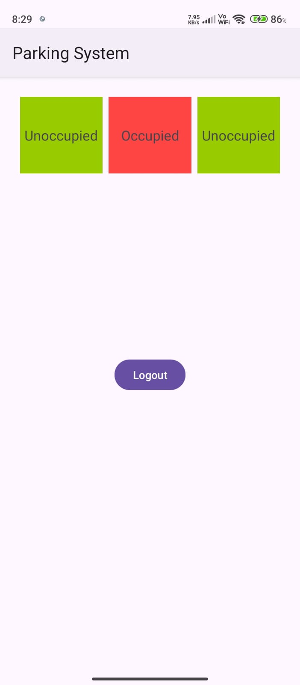
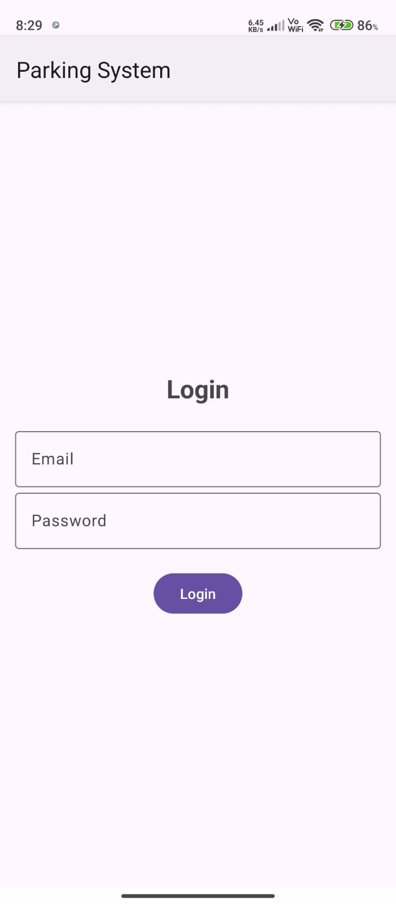

# Smart Parking System

## Overview

The **Smart Parking System** is an Android application that provides real-time status updates on parking slots based on sensor data fetched from Firebase Realtime Database. The app displays whether each slot is occupied or available, using color-coded indicators (red for occupied, green for available).

### 🚧 Current Version

This version of the Smart Parking System includes several key features, with more enhancements planned for future updates to further improve functionality and user experience.

## Features

- **Real-Time Data:** Displays the current status of parking slots using data from Firebase.
- **Color-Coded UI:** Easy-to-understand visual cues with red boxes indicating occupied slots and green boxes indicating available slots.
- **Firebase Integration:** Seamless integration with Firebase Realtime Database for fetching parking slot data.
- **Responsive Design:** Ensures that the app looks good on all screen sizes and orientations.
- **Lightweight:** The app is optimized for performance and battery efficiency.
- **User Authentication:** Added login page to restrict access, making the app suitable for use in private properties.

## Screenshots

<div style="display: flex; gap: 10px;">
    
    
</div>


## Tech Stack

- **Android (Java):** For developing the mobile application.
- **Firebase Realtime Database:** For storing and fetching the parking slot data.
- **Firebase Authentication:** For storing and verifying user credentials, ensuring secure access to private parking spots.
- **XML:** For designing the user interface.


This version clearly outlines the role of Firebase Authentication in your project.
## Setup and Installation

1. **Clone the Repository:**

    ```bash
    git clone https://github.com/ayaxan7/parking-system.git
    cd parking-system
    ```

2. **Open in Android Studio:**
   - Import the project into Android Studio.
   - Make sure all the dependencies are installed.

3. **Firebase Setup:**
   - Create a Firebase project in the [Firebase Console](https://console.firebase.google.com/).
   - Add your Android app to the Firebase project.
   - Download the `google-services.json` file and place it in the `app` directory of your project.
   - Enable Firebase Realtime Database in the Firebase Console and set up the database rules.

4. **Build and Run:**
   - Connect your Android device or start an emulator.
   - Build and run the app from Android Studio.

## Usage

- **Login:** Users must log in to access the app, ensuring that only authorized users can view the parking status, ideal for private properties.
- **View Parking Status:** After logging in, users can see the real-time status of parking slots.
- **Data Update:** The parking slot statuses update automatically based on the sensor data in the Firebase Realtime Database.

## Upcoming Features

- **Enhanced UI:** Improve the user interface for better usability and aesthetics.
- **Notification System:** Send push notifications to users about slot availability.

---
